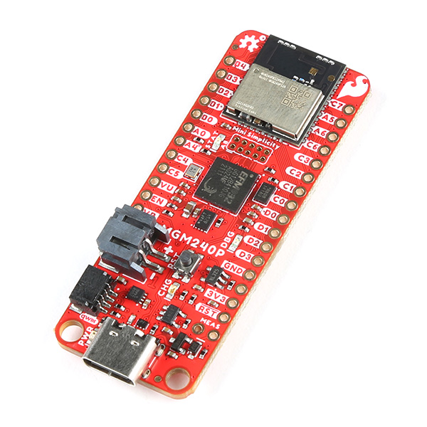

# HelloBlinkRTOS

## Executive Summary
This project was developed **to become familiar with the Silicon Labs Simplicity Studio 5 IDE** and its utility in developing embedded software for SiliconLabs microcontrollers. The intent was to compare it to the STMicroelectronics STM32CubeIDE and its libraries and documentation for STM32 microprocessors, used in Temperature Display, 400 Cellular/Sentry, Temperature Sensor Display and future STM32-based Sentinel products.

Target device at the moment is a SparkFun MGM240P Thing Plus board. Its processor is the SiLabs MGM240P Multi-Protocol Wireless Module.



The first project I've built, HelloBlinkRTOS, does the following "simple" things
- Send debug output out a serial port (8N1, 115200 baud)
- Blink its Status LED
- Use FreeRTOS task

As of 2024.01.20 *I much prefer STM32CubeIDE and STM32CubeProgrammer* over the IDEs from NXP and Silicon Labs.

## Getting the board up and running

After I installed Simplicity Studio 5 on my GreenStarfish Linux laptop, I loaded the example blink_kernel_freertos project, compiled and loaded it onto the board - LED blinked. I modified the blink period and rebuilt the project: LED blinked faster, **confirming the IDE build/install process**. Additionally, this project used FreeRTOS tasking to control the LED blinking.

Next, the example iostream_usart_baremetal project involved input and output over the board's serial port. I wired up a harness to connect power, ground and the serial TX/RX pins on the board to the Sensaphone serial debug board to **confirm input and output on the serial port**.


Much like the Sentry Simulator project for the NXP IDE and evaluation board, the first project I tried to build from scratch in SimplicityStudio should have included hooks for a serial port and an LED, but somehow did not. Again, I wound up **copying and pasting from the aforementioned Simplicity Studio example projects**.


### Initial impressions
- Silicon Labs Simplicity Studio IDE makes example projects and demos more accessible than in STM32CubeIDE.
- Adding/modifying FreeRTOS items like tasks, queues and semaphores/mutexes is done by copying/pasting or otherwise manually typing into code; it requires more FreeRTOS expertise. In contrast, STM32CubeIDE offers graphical selectors and other GUI items; it requires less FreeRTOS expertise.


### TODO things to add
- watchdog timer/timeout
- blink LED from Output task, separate from Main task
- recognize/debounce button press via TBD I/O pin through Input task, i.e. simulate Reset-To-Defaults button (assuming a free I/O pin is available; wire up a switch to it)
- accept simple Diagnostic commands from the debug serial port
- if a real-time clock is available, use it for at least elapsed times

## Version history
### 2024.01.20 v0.0.1
First working project, derived by copying and pasting the example projects 'blink_kernel_freertos' and 'iostream_usart_baremetal' into a newly-created project. Although I tried specifying the status LED and serial port when creating the new project, ultimately I needed to view the project files of the examples to figure out what software components to include. Still, needed to copy and paste the #include files, so *why bother with specifying software components?*

I copied and adapted the PrintStartupBanner() routine and gconfig.h file from the 400 Cellular project, as well as the LOG() macro to print debug output out the serial port.

#### Demo debug output
``````
=================================<=>=================================
                      SparkFun Thing Plus Matter                     
                           HelloBlinkRTOS                            
                               v0.0.1 
                             2024.01.20   
=================================<=>=================================
blink_task: LED toggled...
blink_task: LED toggled...
blink_task: LED toggled...
blink_task: LED toggled...
blink_task: LED toggled...
blink_task: LED toggled...
blink_task: LED toggled...
blink_task: LED toggled...
blink_task: LED toggled...
blink_task: LED toggled...``````
